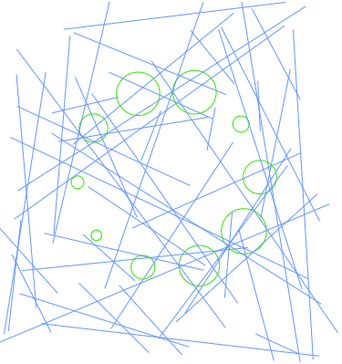

```
function setup() {
  createCanvas(400, 400);
  noFill();
  stroke(0);
}
function draw() {
  background(255);
  let time = millis() / 1000;

  // Colores dinámicos
  let r = map(sin(time), -1, 1, 0, 255);
  let g = map(cos(time), -1, 1, 0, 255);
  let b = map(sin(time * 2), -1, 1, 0, 255);
  stroke(r, g, b);

  let radius = 100;
  let numShapes = 10;

  // Generar patrón de círculos
  for (let i = 0; i < numShapes; i++) {
    let angle = TWO_PI / numShapes * i;
    let x = width / 2 + cos(angle + time) * radius;
    let y = height / 2 + sin(angle + time) * radius;
    let s = map(sin(time + i), -1, 1, 10, 50);
    ellipse(x, y, s, s);
  }

  // Generar líneas aleatorias
  stroke(100, 150, 255);
  for (let i = 0; i < 50; i++) {
    let x1 = random(width);
    let y1 = random(height);
    let x2 = random(width);
    let y2 = random(height);
    line(x1, y1, x2, y2);
  }
}
```

el codigo genera patrones visuales que se modifican con el tiempo en base a funciones random() sen() y cos(), visualmente muestra lineas aleatorias que cambian de tamaño y posicion, a demas de 10 circulos 
que giran al rededor del centro, mientras van cambiando su tamaño y color




