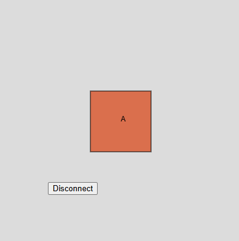

en p5.js

``` js

let port;
let connectBtn;

function setup() {
    createCanvas(400, 400);
    background(220);
    port = createSerial();
    connectBtn = createButton('Connect to micro:bit');
    connectBtn.position(80, 300);
    connectBtn.mousePressed(connectBtnClick);
    fill('white');
    rect(width / 2 - 50, height / 2 - 50, 100, 100);
}

function draw() {

     if(port.availableBytes() > 0){
        let dataRx = port.read(1);
        if(dataRx == 'A'){
            fill(random(255), random(100,200), random(100), random(200,255));
        }
       
        background(220);

        rect(width / 2 - 50, height / 2 - 50, 100, 100);
        fill('black');
        text(dataRx, width / 2, height / 2);
    }


    if (!port.opened()) {
        connectBtn.html('Connect to micro:bit');
    }
    else {
        connectBtn.html('Disconnect');
    }
}

function connectBtnClick() {
    if (!port.opened()) {
        port.open('MicroPython', 115200);
    } else {
        port.close();
    }
}
```

en microbit

``` py
from microbit import *

uart.init(baudrate=115200)
display.show(Image.BUTTERFLY)

while True:
    if button_a.is_pressed():
        uart.write('A')
        sleep(500)
```

para este ejercico use como base el codigo anteriormente dado modificando primero la interaccion con el codigo microbit, dejando solamente la posibilidad de interactuar con la A. luego con el p5.js cambien el circulo por el cuadrado intercambiando "ellipse(width / 2, height / 2, 100, 100);" por "rect(width / 2 - 50, height / 2 - 50, 100, 100);".

tambien quite el boton send love eliminando 

```
let sendBtn = createButton('Send Love');
    sendBtn.position(220, 300);
    sendBtn.mousePressed(sendBtnClick);
```
```
function sendBtnClick() {
    port.write('h');
}
```
por ultimo para que cambie de color intercambie el ('red') por (random(255), random(100,200), random(100), random(200,255))




