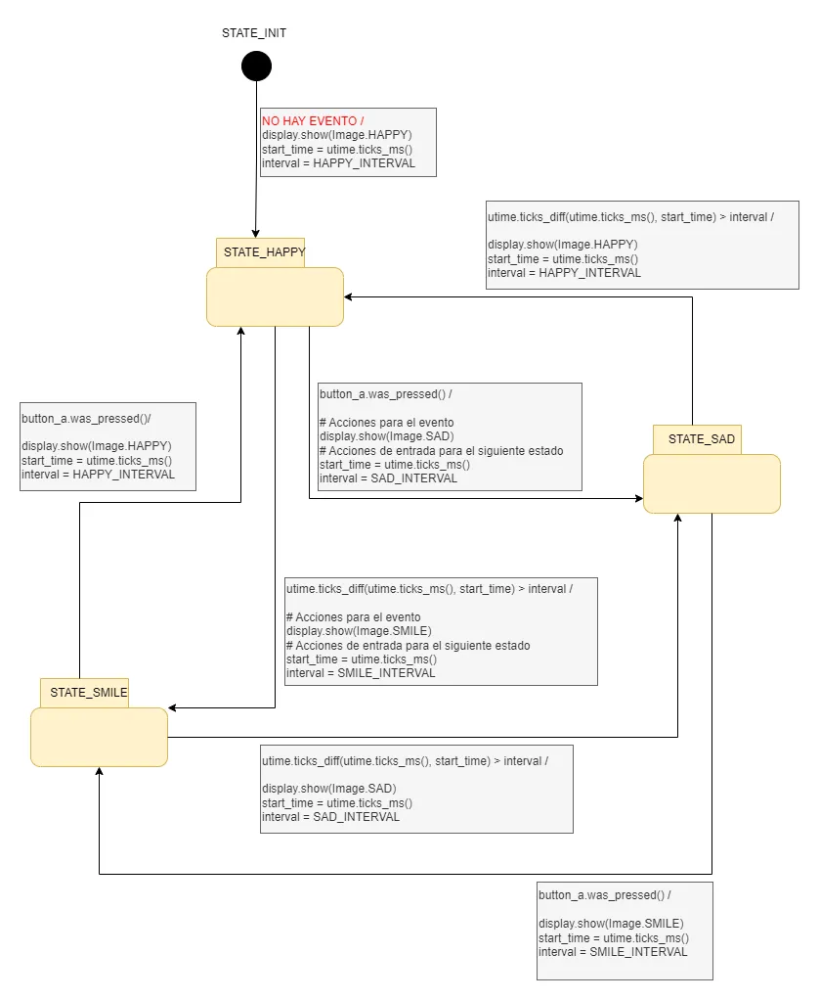

#### Controlando la Pantalla con una Máquina de Estados y Concurrencia

**Enunciado**: implementa el siguiente programa que busca gestionar la concurrencia entre la secuencia de imágenes y la respuesta a la pulsación de botones.

Lee la siguiente descripción del problema y luego analiza la solución implementada. Para el análisis 
trata de observar estas preguntas:

- ¿Cómo es posible estructurar una aplicación usando una máquina de estados para poder atender varios eventos de manera concurrente?
- ¿Cómo haces para probar que el programa está correcto? 

**Descripción del problema**

Imagina un programa para el micro:bit que muestra diferentes expresiones en la pantalla según un ciclo de tiempo, pero que también reacciona de inmediato si presionas un botón. Al iniciar, se muestra una cara feliz durante un segundo y medio. Después, el micro:bit cambia a una expresión sonriente que dura un segundo. Luego, aparece una cara triste durante dos segundos, y el ciclo vuelve a comenzar.

Sin embargo, si en cualquier momento se presiona el botón A mientras la cara feliz o la sonriente están en pantalla, el micro:bit interrumpe el ciclo y muestra inmediatamente la cara triste o feliz, respectivamente. Si se presiona el botón A mientras la cara triste está en pantalla, el dispositivo cambia a la expresión sonriente. Así, el programa combina una secuencia visual predefinida con la capacidad de responder rápidamente a la interacción del usuario.

``` py
from microbit import *
import utime

STATE_INIT = 0
STATE_HAPPY = 1
STATE_SMILE = 2
STATE_SAD = 3

HAPPY_INTERVAL = 1500
SMILE_INTERVAL = 1000
SAD_INTERVAL = 2000

current_state = STATE_INIT
start_time = 0
interval = 0

while True:
    # pseudoestado STATE_INIT
    if current_state == STATE_INIT:
        display.show(Image.HAPPY)
        start_time = utime.ticks_ms()
        interval = HAPPY_INTERVAL
        current_state = STATE_HAPPY
    elif current_state == STATE_HAPPY:
        if button_a.was_pressed():
            # Acciones para el evento
            display.show(Image.SAD)
            # Acciones de entrada para el siguiente estado
            start_time = utime.ticks_ms()
            interval = SAD_INTERVAL
            current_state = STATE_SAD
        if utime.ticks_diff(utime.ticks_ms(), start_time) > interval:
            # Acciones para el evento
            display.show(Image.SMILE)
            # Acciones de entrada para el siguiente estado
            start_time = utime.ticks_ms()
            interval = SMILE_INTERVAL
            current_state = STATE_SMILE
    elif current_state == STATE_SMILE:
        if button_a.was_pressed():
            display.show(Image.HAPPY)
            start_time = utime.ticks_ms()
            interval = HAPPY_INTERVAL
            current_state = STATE_HAPPY
        if utime.ticks_diff(utime.ticks_ms(), start_time) > interval:
            display.show(Image.SAD)
            start_time = utime.ticks_ms()
            interval = SAD_INTERVAL
           current_state = STATE_SAD
    elif current_state == STATE_SAD:
        if button_a.was_pressed():
            display.show(Image.SMILE)
            start_time = utime.ticks_ms()
            interval = SMILE_INTERVAL
            current_state = STATE_SMILE
        if utime.ticks_diff(utime.ticks_ms(), start_time) > interval:
            display.show(Image.HAPPY)
            start_time = utime.ticks_ms()
            interval = HAPPY_INTERVAL
            current_state = STATE_HAPPY

```

**Modelando el programa con un diagrama**




**Entrega**: 

- Explicación donde muestres cómo este programa logra hacer varias cosas a las vez (a esto lo llamamos
concurrencia).
- Describe y aplica al menos 3 vectores de prueba para el programa. Para definir un vector de prueba debes llevar al sistema a un estado, generar los eventos y observar el estado siguiente y las acciones que ocurrirán. Por tanto, un vector de prueba tiene unas condiciones iniciales del sistema, unos resultados esperados y los resultados realmente obtenidos. Si el resultado obtenido es igual al esperado entonces el sistema pasó el vector de prueba, de lo contrario el sistema puede tener un error.


