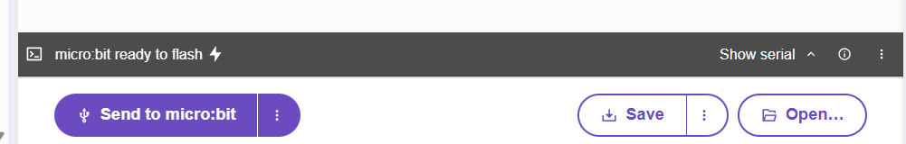

#### Bomba 3.0

**ANTES DE COMENZAR** a trabajar en esta actividad, por favor, lee completamente
el enunciado.

**Enunciado**: añadirás una característica adicional a la bomba.

- Además de controlar la bomba con los sensores del micro:bit, también podrás 
controlarla desde el puerto serial, es decir, se controla desde dos fuentes 
diferentes.
- Debes hacer un refactoring a tu código. La idea es que ahora la máquina 
de estados de la bomba no lea directamente los sensores del micro:bit, sino 
que reciba los eventos de los sensores. De esta manera, la máquina de estados
de la bomba no sabrá de dónde vienen los eventos, si del micro:bit o del puerto
serial. 

¿Cómo puedes hacer esto? 

No te preocupes, te doy una pista: puedes usar una variable booleana para indicar 
si se presionó un botón o si se recibió un mensaje por el puerto serial y además, 
puedes usar una variable para almacenar qué botón se presionó o qué mensaje se recibió.  

Es importante que consumas el evento, es decir, una vez la máquina de estados
de la bomba reciba el evento, la variable que indica que se presionó un botón o
se recibió un mensaje por el puerto serial debe volver a su estado inicial. 

Trata de unificar el valor de la variable que indicará qué botón se presionó o qué
mensaje se recibió por el puerto serial, por ejemplo, si se presionó el botón A,
la variable que almacena el evento debe tener el valor 'A' y si se recibió el mensaje 
'A' por el puerto serial, la variable que almacena el evento debe tener el valor 'A'.

En resumen: cada que ocurra un evento, debes almacenar el evento en una variable y 
cambiar el valor de una variable booleana que indique que ocurrió un evento. La máquina
de estados de la bomba debe leer la variable que almacena el evento y la variable booleana
que indica que ocurrió un evento. Y después de leer el evento, la variable booleana debe 
volver a su estado inicial (consumes el evento).

Estructura de tu programa así:

``` py

def tareaBomba():
    .
    .
    .

def tareaEventos():
    .
    .
    .

while True:
    tareaBomba()
    tareaEventos()
```

La tareaEventos se encargará de leer los eventos de los sensores del micro:bit y
del puerto serial y la tareaBomba se encargará de controlar
la bomba. Recuerda que la tareaBomba no debe leer directamente los sensores, sino
que debe consumir los eventos generados por la tareaEventos. La tareaEventos debe indicar cuando 
se presionó un botón o se recibió un mensaje por el puerto serial y qué botón se presionó
o qué mensaje se recibió.

- Evento para botón A: 'A'
- Evento para botón B: 'B'
- Evento para shake: 'S'
- Evento para botón touch: 'T'

¿Cómo enviarás los eventos del serial? El editor de código del micro:bit tiene una 
consola serial que te permitirá enviar mensajes al micro:bit. Puedes usar esta consola
para enviar los eventos del puerto serial al micro:bit.

- Selecciona los tres puntos al lado del botón Send to micro:bit.
- Selecciona Show serial.
- Click en la terminal (es el espacio en blanco que aparece debajo del texto micro:bit
ready to flash).
- Presiona las teclas que quieras enviar al micro:bit: 'A', 'B', 'S' o 'T'.




**Entrega**: el código de tu programa. Y una explicación de cómo implementaste la funcionalidad 
solicitada.
