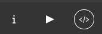
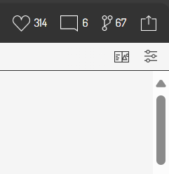
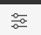
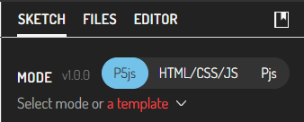

#### Algunos ejemplos inspiradores

Esta actividad puede tomarte un poco más de una hora, ¿Vale? Todo 
dependa de la curiosidad que tengas.

🎯 **Enunciado**: te voy a mostrar algunos ejemplos interesantes y fuentes 
de inspiración que pueden ser de utilidad a la hora de diseñar tus propias 
aplicaciones interactivas con p5.js.

- [Openprocessing](https://openprocessing.org/)

Al explorar este sitio verifica si el ejemplo está hecho con p5.js siguiendo estos pasos:

1. Dale click al tercer ícono de la parte superior derecha.

2. Luego en esta parte de la página:

3. Selecciona el ícono de configuración:

4. Aquí puedes verificar si el modo del sketch es p5.js:

Nota también que en esta parte de la página puedes verificar si el código 
requiere alguna biblioteca adicional y archivos para su correcto funcionamiento (pestaña FILES 
al lado de SKETCH).

Otros sitios que te pueden servir de inspiración:

- [Generative Design](http://www.generative-gestaltung.de/2/)
- [p5.js examples](https://p5js.org/examples/)

📤 **Entrega**: de cada uno de estos sitios selecciona un ejemplo que te haya 
llamado la atención. Luego, en tu entrega, realiza lo siguiente:

- Copia el enlace del ejemplo.
- Describe brevemente qué te llamó la atención del ejemplo.
- Trata de entender cómo está hecho el sketch. ¿Qué funciones de p5.js 
  se están utilizando? ¿Qué técnicas de programación se están aplicando? Puedes 
  buscar en la [documentación de p5.js](https://p5js.org/reference/) para entender mejor el código.
- Vas a crear una cuenta en p5.js (tal vez ya la tienes) y vas a recrear en 
el editor de p5.js el ejemplo. Realiza una modificación a cada ejemplo y 
describe qué cambios hiciste y por qué.
- Comparte el enlace de tu sketch en p5.js. ¿Cómo? Una vez crees la cuenta 
y salves el sketch recreado, la url de tu sketch aparecerá en la parte superior
de la página. Copia y pega esa url en tu entrega.

Por ejemplo, mira este ensayo que yo hice:

En openprocessing encontré este [ejemplo](https://openprocessing.org/sketch/873380).  
Lo recree en el editor de p5.js y cambié la imagen de fondo: 
[mi versión](https://editor.p5js.org/juanferfranco/sketches/nPoxS9VfW).
