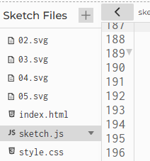

#### Caso de estudio: p5.js 

Esta actividad será larga, te tomará posiblemente una o más sesiones de trabajo. Te pido 
que a medida que la recorres vayas tomando notas de tus hallazgos y experimentos en la 
bitácora. Tómate tu tiempo para analizar y comprender cada parte del código. La idea 
no es leer de corrido el código, sino analizarlo ¿Cómo? Haciendo experimentos, modificando 
partes del código, ejecutando y observando los resultados. A esto se le llama 
**aprendizaje activo**.

🎯 **Enunciado**: en esta actividad vas a modificar diferentes partes del 
código original para que puedas controlar ciertas partes de este con el micro:bit.

- Crea un nuevo proyecto p5.js. 
- Modifica el archivo index.html así:

``` html	
<!DOCTYPE html>
<html>
  <head>
    <script src="https://cdn.jsdelivr.net/npm/p5/lib/p5.min.js"></script>
    <script src="https://unpkg.com/@gohai/p5.webserial@^1/libraries/p5.webserial.js"></script>
    <link rel="stylesheet" type="text/css" href="style.css">
  </head>
  <body>
    <script src="sketch.js"></script>
  </body>
</html>

```

- Compara el código original del caso de estudio con el anterior. ¿Qué notas de diferente?

La aplicación requiere algunas imágenes que puedes descargar de la aplicación original. ¿Cómo? 
Lo primero es autenticarte en el editor de p5.js. Luego abre el sketch original y 
realiza una modificación simple. Guarda el sketch. Nota que ahora este código está en tu cuenta. 
Descarga las imágenes, ingresando al menú `File`. Finalmente, carga las imágenes a la carpeta 
de tu proyecto p5.js así:



Ahora modifica el archivo sketch.js así:

``` js
const lineModule = [];

function preload() {
  lineModule[1] = loadImage("02.svg");
  lineModule[2] = loadImage("03.svg");
  lineModule[3] = loadImage("04.svg");
  lineModule[4] = loadImage("05.svg");
}

function setup() {
  createCanvas(400, 400);
}

function draw() {
  background(220);
}
```

Ejecuta el sketch. Si no tienes errores podrás continuar. Reflexiona ¿Para qué se 
usan estas imágenes? ¿Qué representan? Revisa de nuevo el sketch original y 
analiza.

Recuerda que en el código del micro:bit, cada 100 ms se están enviando datos; 
sin embargo, la aplicación no podrá comenzar a usar dichos datos antes de que 
el usuario de manera explícita conecte el micro:bit a la aplicación.

Entonces tienes un problema en el cual una aplicación se comporta diferente dependiente 
del ESTADO en el que se encuentra. ¿Cómo puedes solucionar este tipo de problema? 
Ya lo sabes: máquinas de estado.

Modifica el archivo sketch.js para que puedas controlar el estado de la aplicación:

``` js
const lineModule = [];

function preload() {
  lineModule[1] = loadImage("02.svg");
  lineModule[2] = loadImage("03.svg");
  lineModule[3] = loadImage("04.svg");
  lineModule[4] = loadImage("05.svg");
}

const STATES = {
  WAIT_MICROBIT_CONNECTION: "WAITMICROBIT_CONNECTION",
  RUNNING: "RUNNING",
};

let appState = STATES.WAIT_MICROBIT_CONNECTION;

function setup() {
  createCanvas(windowWidth, windowHeight);
  background(255);
}

function draw() {
  switch (appState) {
    case STATES.WAIT_MICROBIT_CONNECTION:
      break;

    case STATES.RUNNING:
      break;
  }
}

```

Recuerda que en una aplicación p5.js, la función setup() se llama solo una vez. Luego 
se llamará la función draw() cada 17 ms que equivale a 60 fps. No olvides entonces que 
cada vez que draw() se llama, la aplicación evalúa el valor de appState para decidir 
qué hará en ese frame, o dicho de otra manera qué hará en el estado actual.

¿Recuerdas que en las unidades anteriores teníamos un pseudoestado llamado INIT? 
Se llama pseudoestado porque cuando la aplicación está en este realmente NO ESTÁ 
ESPERANDO nada. ¿Puedes notar que no tenemos a INIT en este caso? Pero la verdad si está, 
solo que no como antes, la función setup() está haciendo esa función. ¿Lo ves?

Ahora es momento de programar el comportamiento del estado `STATES.WAIT_MICROBIT_CONNECTION`.  
Recuerda que la aplicación en `este estado`, en cada frame, simplemente está esperando a que el 
usuario conecte el micro:bit. Observa el código, agregaré algunas variables:

``` js
const lineModule = [];

function preload() {
  lineModule[1] = loadImage("02.svg");
  lineModule[2] = loadImage("03.svg");
  lineModule[3] = loadImage("04.svg");
  lineModule[4] = loadImage("05.svg");
}

//*********************************
// Código para soportar el serial
let port;
let connectBtn;
let microBitConnected = false;
//*********************************

const STATES = {
  WAIT_MICROBIT_CONNECTION: "WAITMICROBIT_CONNECTION",
  RUNNING: "RUNNING",
};
let appState = STATES.WAIT_MICROBIT_CONNECTION;

function setup() {
  createCanvas(windowWidth, windowHeight);
  background(255);
}

function draw() {
  switch (appState) {
    case STATES.WAIT_MICROBIT_CONNECTION:
      break;

    case STATES.RUNNING:
      break;
  }
}

```

Observa que port, connectBtn y microBitConnected son variables globales. Se necesitan así 
porque las vas a manipular en cualquier función del programa. No olvides que las variables 
que declaremos dentro de las funciones solo serán visibles dentro de la función, no por fuera.

Ahora añadiremos en la función setup el código que permitirá conectarse al micro:bit:

``` js
const lineModule = [];

function preload() {
  lineModule[1] = loadImage("02.svg");
  lineModule[2] = loadImage("03.svg");
  lineModule[3] = loadImage("04.svg");
  lineModule[4] = loadImage("05.svg");
}

//*********************************
// Código para soportar el serial
let port;
let connectBtn;
let microBitConnected = false;
//*********************************

const STATES = {
  WAIT_MICROBIT_CONNECTION: "WAITMICROBIT_CONNECTION",
  RUNNING: "RUNNING",
};
let appState = STATES.WAIT_MICROBIT_CONNECTION;

function setup() {
  createCanvas(windowWidth, windowHeight);
  background(255);
  //****************************************************
  // Adición del serial
  port = createSerial();
  connectBtn = createButton("Connect to micro:bit");
  connectBtn.position(0, 0);
  connectBtn.mousePressed(connectBtnClick);
  //****************************************************
}

function draw() {
  switch (appState) {
    case STATES.WAIT_MICROBIT_CONNECTION:
      break;

    case STATES.RUNNING:
      break;
  }
}
```

- createSerial(): crea el objeto que representará la conexión serial y devolverá la dirección 
de memoria de este objeto que se almacenará en la variable port.
- createButton(): crea un objeto que representará a un botón en la aplicación. La dirección de 
este objeto quedará almacenada en la variable connectBtn. 
- Observa que por medio de connectBtn, que contiene la dirección del objeto, se manipulará la posición del objeto y el comportamiento de este al presionarlo con el mouse mousePressed. Nota que al método mousePressed() le estás 
pasando el nombre de una función connectBtnClick. De esta manera al presionar el botón se llamará dicha función.


Añadimos entonces la función connectBtnClick():

``` js
const lineModule = [];

function preload() {
  lineModule[1] = loadImage("02.svg");
  lineModule[2] = loadImage("03.svg");
  lineModule[3] = loadImage("04.svg");
  lineModule[4] = loadImage("05.svg");
}

let port;
let connectBtn;
let microBitConnected = false;

const STATES = {
  WAIT_MICROBIT_CONNECTION: "WAITMICROBIT_CONNECTION",
  RUNNING: "RUNNING",
};
let appState = STATES.WAIT_MICROBIT_CONNECTION;

function setup() {
  createCanvas(windowWidth, windowHeight);
  background(255);
  port = createSerial();
  connectBtn = createButton("Connect to micro:bit");
  connectBtn.position(0, 0);
  connectBtn.mousePressed(connectBtnClick);
}


//****************************************************
function connectBtnClick() {
  if (!port.opened()) {
    port.open("MicroPython", 115200);
  } else {
    port.close();
  }
}
//****************************************************

function draw() {
  switch (appState) {
    case STATES.WAIT_MICROBIT_CONNECTION:
      break;

    case STATES.RUNNING:
      break;
  }
}
```

¿Qué pasaría ahora si das click al botón? Observa que en la función se verifica si 
el puerto serial no está abierto. De ser así se abren con el método open("MicroPython", 115200). 
De lo contrario el puerto se cerrará. 

¿Para qué abres el puerto serial? Se abre para poder recibir los datos del micro:bit, 
es decir, para conectarte al micro:bit y poder recibir los datos que está enviando en 
esta parte de su código:

``` py
data = "{},{},{},{}\n".format(xValue, yValue, aState, bState)
uart.write(data)
```

Verifica el funcionamiento de la aplicación hasta este momento. Todo debería estar 
bien.

Una vez ejecutes el programa nota que debe aparecer en la esquina superior izquierda 
el botón para conectarse al micro:bit: Connect to micro:bit. Observa la consola para 
que puedas ver los mensajes que te saldrán.

Observa detenidamente algo interesante. Una vez te conectas al micro:bit el botón sigue 
con el texto: `Connect to micro:bit`, pero ya estás conectado. Es necesario informar al 
usuario que la funcionalidad del botón cambiará.

Para lograr lo anterior, al inicio de draw() y por tanto en cada frame se comprobará si 
el puerto está abierto o cerrado. Esto permitirá cambiar el texto del botón y además 
permitirá generar el evento microBitConnected para informarle al resto de la aplicación 
el estado del puerto.

``` js
const lineModule = [];

function preload() {
  lineModule[1] = loadImage("02.svg");
  lineModule[2] = loadImage("03.svg");
  lineModule[3] = loadImage("04.svg");
  lineModule[4] = loadImage("05.svg");
}

let port;
let connectBtn;
let microBitConnected = false;

const STATES = {
  WAIT_MICROBIT_CONNECTION: "WAITMICROBIT_CONNECTION",
  RUNNING: "RUNNING",
};
let appState = STATES.WAIT_MICROBIT_CONNECTION;

function setup() {
  createCanvas(windowWidth, windowHeight);
  background(255);

  port = createSerial();
  connectBtn = createButton("Connect to micro:bit");
  connectBtn.position(0, 0);
  connectBtn.mousePressed(connectBtnClick);
}

function connectBtnClick() {
  if (!port.opened()) {
    port.open("MicroPython", 115200);
  } else {
    port.close();
  }
}

function draw() {
  //******************************************
  if (!port.opened()) {
    connectBtn.html("Connect to micro:bit");
    microBitConnected = false;
  } else {
    microBitConnected = true;
    connectBtn.html("Disconnect");
  }
  //*******************************************

  switch (appState) {
    case STATES.WAIT_MICROBIT_CONNECTION:
      break;

    case STATES.RUNNING:
      break;
  }
}
```

Ejecuta de nuevo la aplicación y verifica que funciona correctamente.

Ahora vamos a añadir la parte del código que lee los datos del micro:bit.

``` js
const lineModule = [];

function preload() {
  lineModule[1] = loadImage("02.svg");
  lineModule[2] = loadImage("03.svg");
  lineModule[3] = loadImage("04.svg");
  lineModule[4] = loadImage("05.svg");
}

let port;
let connectBtn;
let microBitConnected = false;

const STATES = {
  WAIT_MICROBIT_CONNECTION: "WAITMICROBIT_CONNECTION",
  RUNNING: "RUNNING",
};
let appState = STATES.WAIT_MICROBIT_CONNECTION;

function setup() {
  createCanvas(windowWidth, windowHeight);
  background(255);

  port = createSerial();
  connectBtn = createButton("Connect to micro:bit");
  connectBtn.position(0, 0);
  connectBtn.mousePressed(connectBtnClick);
}

function connectBtnClick() {
  if (!port.opened()) {
    port.open("MicroPython", 115200);
  } else {
    port.close();
  }
}

function draw() {
  //******************************************
  if (!port.opened()) {
    connectBtn.html("Connect to micro:bit");
    microBitConnected = false;
  } else {
    microBitConnected = true;
    connectBtn.html("Disconnect");
    if (port.availableBytes() > 0) {
      let data = port.readUntil("\n");
      if (data) {
        data = data.trim();
        let values = data.split(",");
        if (values.length == 4) {
          microBitX = int(values[0]) + windowWidth / 2;
          microBitY = int(values[1]) + windowHeight / 2;
          microBitAState = values[2].toLowerCase() === "true";
          microBitBState = values[3].toLowerCase() === "true";
          updateButtonStates(microBitAState, microBitBState);
        } else {
          print("No se están recibiendo 4 datos del micro:bit");
        }
      }
    }
  }
  //*******************************************

  switch (appState) {
    case STATES.WAIT_MICROBIT_CONNECTION:
      break;

    case STATES.RUNNING:
      break;
  }
}

```

Nota que solo se leen datos del micro:bit si el puerto está abierto ¿Por qué? ¿Podrías 
leer datos si el puerto está cerrado? ¿Qué pasaría si el puerto está cerrado y 
el micro:bit envía datos?

Ahora te pediré que te concentres.  Para leer los datos que vienen del micro:bit, la 
aplicación primero pregunta si al menos hay un dato disponible para leer. Piensa que 
hay una parte del código de la biblioteca p5.webserial que se encarga de recibir 
los datos (como si fuera el portero de un edificio) y tu lo único que tienes que 
preguntar es si al menos ya tienes un dato para leer. 

``` js	
if (port.availableBytes() > 0) 
```
​
Una vez sabes que al menos hay un dato, te quedas esperando que esté completa 
la `LINEA` que contiene todos los datos:

``` js	
let data = port.readUntil("\n");
```
​​
Pero ¿Cómo sabes que ya está completa la línea? La función readUntil esperará a que llegue 
el byte que representa el fin de línea: `"\n"`. Por tanto, el 
micro:bit tendrá que MARCAR esto en cada paquete de datos que envíe:

``` py 
data = "{},{},{},{}\n".format(xValue, yValue, aState, bState)
```

¿Puedes verlo? ¿Qué pasaría si el micro:bit no envía el `"\n"`? 

Una vez recibes el paquete completo que envió el micro:bit, verificas si el dato es válido:

``` js	
if (data)
```
​
Y procedes a eliminar de los datos el `"\n"`, ya que este solo lo necesitas para 
marcar el fin del paquete de datos:

``` js
data = data.trim();
```
Ahora necesitas extraer de la cadena enviada cada uno de los datos, es decir, el valor 
de x, de y, el estado de A y de B:

``` js 
let values = data.split(",");
```
Regresa al código del micro:bit:

``` py
data = "{},{},{},{}\n".format(xValue, yValue, aState, bState)
```
Cada `{}` es reemplazada por el valor de las variables xValue, yValue, aState, bState 
respectivamente. Además, observa el carácter `,` que separa cada valor.

En resumen hasta ahora. El micro:bit al enviar esta cadena:

``` py
data = "{},{},{},{}\n".format(xValue, yValue, aState, bState)
```

Está separando los valor por coma y marcando el fin del mensaje con un retorno de carro (`\n`) o enter. 

A esto se le conoce como un `PROTOCOLO`. Si la aplicación en p5.js quiere recibir correctamente los 
datos tendrá que seguir el `PROTOCOLO` para poder extraer correctamente la información.

Retomemos:

``` js
let values = data.split(",");
```

Esta parte devuelve un ARREGLO de cadenas y la dirección de este arreglo se almacenará en values. 

Considera ahora lo siguiente. Cuando estás comunicando dos aplicaciones es fundamental verificar la integridad de la 
información recibida. En este caso, el micro:bit está enviando 4 datos, por lo que la aplicación
en p5.js debe verificar que efectivamente se recibieron los 4 datos:

``` js
if (values.length == 4) {
```
​
Para analizar lo que sigue debemos volver al código del micro:bit:

``` py
data = "{},{},{},{}\n".format(xValue, yValue, aState, bState)
```

Como ya te dije antes, cada `{}` es reemplazada por el valor de las variables xValue, yValue,
aState, bState respectivamente. Ten presente que toda la información está 
[CODIFICAD en ASCII](https://www.asciitable.com/), 
es decir, si xValue es 100, realmente no estás enviando el byte que representa ese 100 sino 
que estás codificando cada número en ASCII. Por tanto, el 100 realmente se envía como tres 
bytes: 49, 48, 48.

Es por ello que esta parte del código:

``` js
microBitX = int(values[0]) + windowWidth/2;
microBitY = int(values[1]) + windowHeight/2;
microBitAState = values[2].toLowerCase() === "true";
microBitBState = values[3].toLowerCase() === "true";
```
Necesita convertir cada cadena en un número entero y además necesita convertir las cadenas
que representan los estados de los botones en un valor booleano.

Te estarás preguntando ¿Por qué se suma `windowWidth/2` y `windowHeight/2` a los valores de x e y? 
Esta respuesta te toca analizarla a ti. No olvides escribir tus hallazgos en la bitácora.

Por último, la función `updateButtonStates` se encargará de actualizar el estado de los botones. Vamos 
a añadir esta función al código:

``` js	
const lineModule = [];

function preload() {
  lineModule[1] = loadImage("02.svg");
  lineModule[2] = loadImage("03.svg");
  lineModule[3] = loadImage("04.svg");
  lineModule[4] = loadImage("05.svg");
}

let port;
let connectBtn;
let microBitConnected = false;

const STATES = {
  WAIT_MICROBIT_CONNECTION: "WAITMICROBIT_CONNECTION",
  RUNNING: "RUNNING",
};
let appState = STATES.WAIT_MICROBIT_CONNECTION;
let microBitX = 0;
let microBitY = 0;
let microBitAState = false;
let microBitBState = false;
let prevmicroBitAState = false;
let prevmicroBitBState = false;

function setup() {
  createCanvas(windowWidth, windowHeight);
  background(255);

  port = createSerial();
  connectBtn = createButton("Connect to micro:bit");
  connectBtn.position(0, 0);
  connectBtn.mousePressed(connectBtnClick);
}

function connectBtnClick() {
  if (!port.opened()) {
    port.open("MicroPython", 115200);
  } else {
    port.close();
  }
}

function updateButtonStates(newAState, newBState) {
  // Generar eventos de keypressed
  if (newAState === true && prevmicroBitAState === false) {
    // create a new random color and line length
    lineModuleSize = random(50, 160);
    // remember click position
    clickPosX = microBitX;
    clickPosY = microBitY;
    print("A pressed");
  }
  // Generar eventos de key released
  if (newBState === false && prevmicroBitBState === true) {
    c = color(random(255), random(255), random(255), random(80, 100));
    print("B released");
  }

  prevmicroBitAState = newAState;
  prevmicroBitBState = newBState;
}

function draw() {
  //******************************************
  if (!port.opened()) {
    connectBtn.html("Connect to micro:bit");
    microBitConnected = false;
  } else {
    microBitConnected = true;
    connectBtn.html("Disconnect");
    if (port.availableBytes() > 0) {
      let data = port.readUntil("\n");
      if (data) {
        data = data.trim();
        let values = data.split(",");
        if (values.length == 4) {
          microBitX = int(values[0]) + windowWidth / 2;
          microBitY = int(values[1]) + windowHeight / 2;
          microBitAState = values[2].toLowerCase() === "true";
          microBitBState = values[3].toLowerCase() === "true";
          updateButtonStates(microBitAState, microBitBState);
        } else {
          print("No se están recibiendo 4 datos del micro:bit");
        }
      }
    }
  }
  //*******************************************

  switch (appState) {
    case STATES.WAIT_MICROBIT_CONNECTION:
      break;

    case STATES.RUNNING:
      break;
  }
}
```

Ahora, si ejecutas la aplicación y conectas el micro:bit, podrás ver que al presionar el botón A
se generará un evento de keypressed y al soltar el botón B se generará un evento de keyreleased. 
Además los valores de microBitX y microBitY se actualizarán con los valores que envía el micro:bit.

¿Cómo puedes verificar que los eventos de keypressed y keyreleased se están generando? Piensa 
en cómo puedes hacerlo y escribe tus hallazgos en la bitácora.

Ahora te pediré que analices el algoritmo updateButtonStates. ¿Qué hace? ¿Por qué es necesario
almacenar el estado anterior de los botones? ¿Qué pasaría si no se almacenara el estado anterior?

Seguimos. Vamos a añadir comportamientos a cada uno de los estados de la aplicación. Recuerda, 
en un estado se espera la ocurrencia de uno o varios eventos. Eso puede generar acciones y 
posiblemente un cambio de estado.

``` js
    case STATES.WAIT_MICROBIT_CONNECTION:
      // No puede comenzar a dibujar hasta que no se conecte el microbit
      // evento 1:
      if (microBitConnected === true) {
        // Preparo todo para el estado en el próximo frame
        print("Microbit ready to draw");
        strokeWeight(0.75);
        c = color(181, 157, 0);
        noCursor();
        appState = STATES.RUNNING;
      }

      break;
```

En cada frame se verifica si el micro:bit está conectado. Si es así, se prepara todo para 
el estado RUNNING. Te muestro el código completo incluyendo las variables de aplicación nuevas 
que utilizará el estado RUNNING, así como el resto del código del sketch original:

``` js
let c;
let lineModuleSize = 0;
let angle = 0;
let angleSpeed = 1;
const lineModule = [];
let lineModuleIndex = 0;
let clickPosX = 0;
let clickPosY = 0;

function preload() {
  lineModule[1] = loadImage("02.svg");
  lineModule[2] = loadImage("03.svg");
  lineModule[3] = loadImage("04.svg");
  lineModule[4] = loadImage("05.svg");
}

let port;
let connectBtn;
let microBitConnected = false;

const STATES = {
  WAIT_MICROBIT_CONNECTION: "WAITMICROBIT_CONNECTION",
  RUNNING: "RUNNING",
};
let appState = STATES.WAIT_MICROBIT_CONNECTION;
let microBitX = 0;
let microBitY = 0;
let microBitAState = false;
let microBitBState = false;
let prevmicroBitAState = false;
let prevmicroBitBState = false;

function setup() {
  createCanvas(windowWidth, windowHeight);
  background(255);

  port = createSerial();
  connectBtn = createButton("Connect to micro:bit");
  connectBtn.position(0, 0);
  connectBtn.mousePressed(connectBtnClick);
}

function connectBtnClick() {
  if (!port.opened()) {
    port.open("MicroPython", 115200);
  } else {
    port.close();
  }
}

function updateButtonStates(newAState, newBState) {
  // Generar eventos de keypressed
  if (newAState === true && prevmicroBitAState === false) {
    // create a new random color and line length
    lineModuleSize = random(50, 160);
    // remember click position
    clickPosX = microBitX;
    clickPosY = microBitY;
    print("A pressed");
  }
  // Generar eventos de key released
  if (newBState === false && prevmicroBitBState === true) {
    c = color(random(255), random(255), random(255), random(80, 100));
    print("B released");
  }

  prevmicroBitAState = newAState;
  prevmicroBitBState = newBState;
}

function windowResized() {
  resizeCanvas(windowWidth, windowHeight);
}

function draw() {
  //******************************************
  if (!port.opened()) {
    connectBtn.html("Connect to micro:bit");
    microBitConnected = false;
  } else {
    microBitConnected = true;
    connectBtn.html("Disconnect");
    if (port.availableBytes() > 0) {
      let data = port.readUntil("\n");
      if (data) {
        data = data.trim();
        let values = data.split(",");
        if (values.length == 4) {
          microBitX = int(values[0]) + windowWidth / 2;
          microBitY = int(values[1]) + windowHeight / 2;
          microBitAState = values[2].toLowerCase() === "true";
          microBitBState = values[3].toLowerCase() === "true";
          updateButtonStates(microBitAState, microBitBState);
        } else {
          print("No se están recibiendo 4 datos del micro:bit");
        }
      }
    }
  }
  //*******************************************

  switch (appState) {
    case STATES.WAIT_MICROBIT_CONNECTION:
      // No puede comenzar a dibujar hasta que no se conecte el microbit
      // evento 1:
      if (microBitConnected === true) {
        // Preparo todo para el estado en el próximo frame
        print("Microbit ready to draw");
        strokeWeight(0.75);
        c = color(181, 157, 0);
        noCursor();
        appState = STATES.RUNNING;
      }

      break;

    case STATES.RUNNING:
      // EVENTO: estado de conexión del microbit
      if (microBitConnected === false) {
        print("Waiting microbit connection");
        cursor();
        appState = STATES.WAIT_MICROBIT_CONNECTION;
      }

      //EVENTO: recepción de datos seriales del micro:bit

      if (microBitAState === true) {
        let x = microBitX;
        let y = microBitY;

        if (keyIsPressed && keyCode === SHIFT) {
          if (abs(clickPosX - x) > abs(clickPosY - y)) {
            y = clickPosY;
          } else {
            x = clickPosX;
          }
        }

        push();
        translate(x, y);
        rotate(radians(angle));
        if (lineModuleIndex != 0) {
          tint(c);
          image(
            lineModule[lineModuleIndex],
            0,
            0,
            lineModuleSize,
            lineModuleSize
          );
        } else {
          stroke(c);
          line(0, 0, lineModuleSize, lineModuleSize);
        }
        angle += angleSpeed;
        pop();
      }

      break;
  }
}

function keyPressed() {
  if (keyCode === UP_ARROW) lineModuleSize += 5;
  if (keyCode === DOWN_ARROW) lineModuleSize -= 5;
  if (keyCode === LEFT_ARROW) angleSpeed -= 0.5;
  if (keyCode === RIGHT_ARROW) angleSpeed += 0.5;
}

function keyReleased() {
  if (key === "s" || key === "S") {
    let ts =
      year() +
      nf(month(), 2) +
      nf(day(), 2) +
      "_" +
      nf(hour(), 2) +
      nf(minute(), 2) +
      nf(second(), 2);
    saveCanvas(ts, "png");
  }
  if (keyCode === DELETE || keyCode === BACKSPACE) background(255);

  // reverse direction and mirror angle
  if (key === "d" || key === "D") {
    angle += 180;
    angleSpeed *= -1;
  }

  // default colors from 1 to 4
  if (key === "1") c = color(181, 157, 0);
  if (key === "2") c = color(0, 130, 164);
  if (key === "3") c = color(87, 35, 129);
  if (key === "4") c = color(197, 0, 123);

  // load svg for line module
  if (key === "5") lineModuleIndex = 0;
  if (key === "6") lineModuleIndex = 1;
  if (key === "7") lineModuleIndex = 2;
  if (key === "8") lineModuleIndex = 3;
  if (key === "9") lineModuleIndex = 4;
}

```

Observa el código original y el nuevo código. ¿Qué diferencias encuentras?
¿Qué pasó con algunos eventos del mouse? ¿Qué paso con la función relacionada 
con la barra de espacio del teclado?

Ejecuta la aplicación. Mira en la consola los mensajes que se generan. Nota 
en particular uno que dice: `No se están recibiendo 4 datos del micro:bit` ¿Qué significa 
esto? Analiza si este mensaje ocurre en varios frames o solo en uno. ¿Por qué? 
¿Qué puedes hacer para solucionar este problema? (Ten presente que esta pregunta 
es abierta y no tiene una única respuesta).

Finalmente, juega con la aplicación y `DIBUJA`.

📤 **Entrega**: reporta los experimentos y hallazgos que vas encontrando a medida 
que analizas el código y responde las preguntas que te voy haciendo en el enunciado.